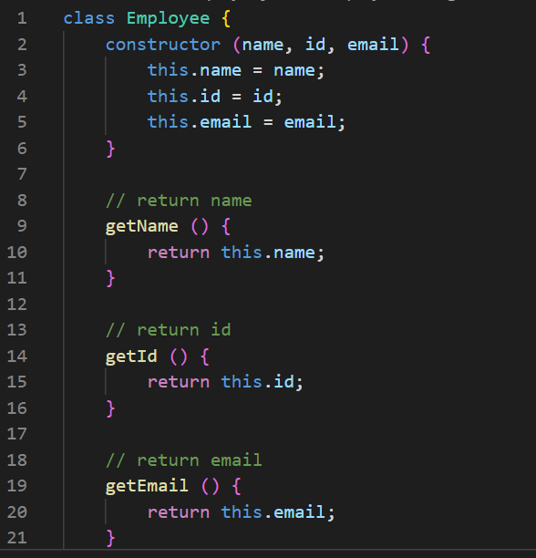

# Team-Maker

## General Info
AS A manager
I WANT to generate a webpage that displays my team's basic info
SO THAT I have quick access to their emails and GitHub profiles.

## Testing
Part of this project called for running tests using Jest. This was done by installing the jest npm package and then setting up the __tests__ folder to match the actual js files used. To follow TDD protocol the tests needed to be set up to fail and then later pass.

At the time the tests were referencing empty js files which were then completed to pass the tests.

The tests were written to make sure that each data point needed later to populate the html files worked as intended.

## Creating Classes
The tests in the prior section were used to check the creation of the different classes needed for this project. When prompted, the user would need to fill in a manager and possibly engineers and/or interns. This meant that there needed to be at least a class for manager, engineer, and intern. To make the code cleaner, each of these classes extended from a base class of employee that housed the common data points needed for each.

## User Prompts and Generating the HTML
The purpose of this project was to enable a "manager" to fill out information about their employees in order to generate an html file displaying their team. When the app is started, the user is prompted to answer questions about the manager and then afterwards about other employees. The questions were set up using inquirer and then all the data collected was used to populate the generated html page. Each card was created and styled separately and then the framework for the page was set as well. The content of the html file would depend on the user's inputs.

## Links
- Github repository: https://github.com/hvphan1993/Team-Maker.git
- Walkthrough video: 
